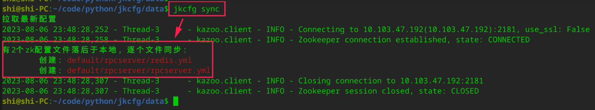

[GitHub](https://github.com/shigebeyond/jkcfg) | [Gitee](https://gitee.com/shigebeyond/jkcfg)

# jkcfg - 配置信息同步器

## 概述
jkcfg，是配置信息同步器，整合 zookeeper 做配置信息的同步处理，能为微服务应用提供集中化的配置管理(存储与分发)。

而 zookeeper 可用于做分布式配置中心，能够集中化管理不同环境不同应用的配置，当配置修改后能够实时推送到应用端。

jkcfg 参考 Spring Cloud Config 的实现，使用git来存储配置文件，天然支持对配置信息的版本管理；同时整合 zookeeper，将配置文件同步到 zookeeper上，从而完成分布式配置对微服务应用的分发。

## 安装
```
pip3 install jkcfg
```

安装后会生成命令`jkcfg`;

注： 对于深度deepin-linux系统，生成的命令放在目录`~/.local/bin`，建议将该目录添加到环境变量`PATH`中，如
```
export PATH="$PATH:/home/shi/.local/bin"
```

## 使用

### 配置
1. 新建工作目录
2. 在工作目录中创建配置文件 `jkcfg.yml`
```yaml
repo_url: git@120.24.63.157:zkcfg # 配置文件的git仓库
zk_hosts: '10.103.47.192:2181' # zookeeper server
redis_host: 'localhost:6379' # redis server
sync_interval: 10 # 定时同步的时间间隔, 如果为0则不做定时同步
#diff_tool: vimdiff # 文件对比工具, 默认使用vimdiff
```

### 运行命令
#### 1. 拉取最新配置文件, 拉取的文件放到`工作目录/repo`仓库目录中
```sh
jkcfg pull
```
工作目录的结构如下:


仓库目录中有2个配置文件:
```
default/rpcserver/redis.yml
default/rpcserver/rpcserver.yml
```

#### 2. 对比本地(仓库目录)的配置文件与zookeeper上的配置文件
```sh
# 整体对比: 列出zookeeper落后的配置文件
jkcfg diff
# 单个配置文件对比: 使用vimdiff工具来，对比本地与zookeeper上的同名的配置文件
jkcfg diff default/rpcserver/redis.yml
```
执行效果如下:


#### 3. 同步本地(仓库目录)的配置文件到zookeeper上
```sh   
jkcfg sync
```
执行效果如下:



我们使用`zkCli.sh`命令来查看zookeeper上的节点数据


对比本地同路径的配置文件, 文件内容是一样的


#### 4. 通知同步: 发同步的消息, 一般用在 git 钩子中, 在配置仓库推送时通知worker来同步
```sh   
# 当前目录需有 jkcfg.yml 配置文件
jkcfg notify
# 无需 jkcfg.yml 配置文件, 直接在命令行中指定redis消息队列
jkcfg notify -r localhost:6379 
```

#### 5. 启动同步任务worker(接收同步的消息并执行同步) + 启动同步的定时任务(时间间隔见配置项`sync_interval`)
```sh   
jkcfg work
```